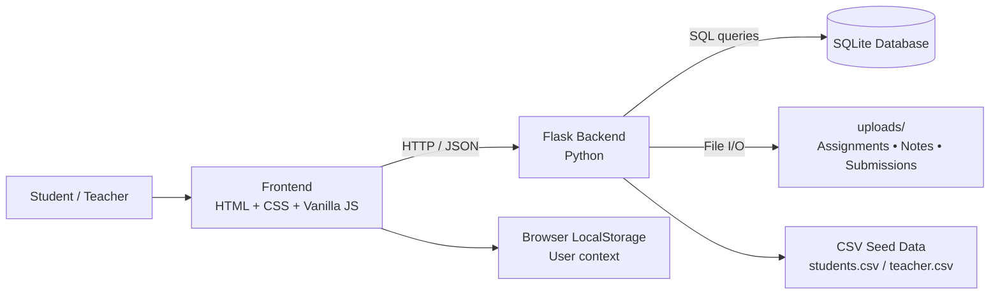
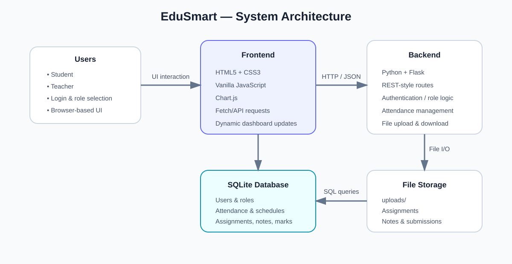
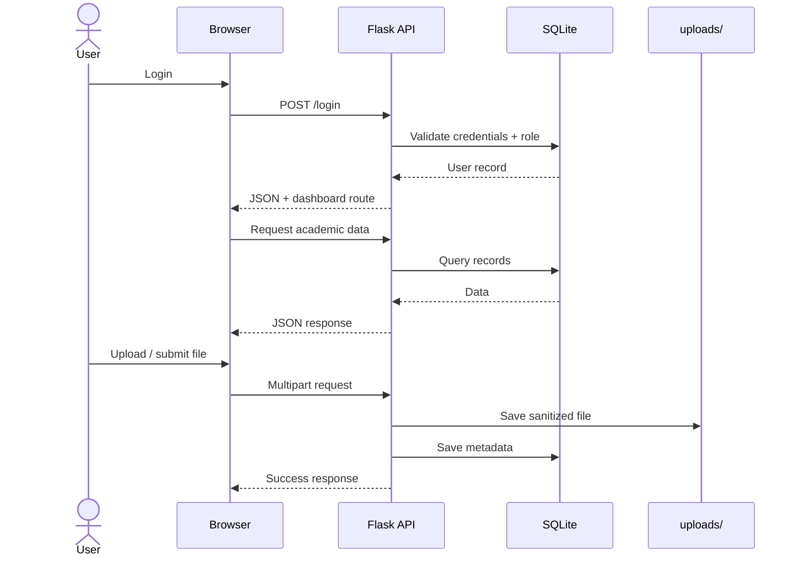

<div align="center">

# 🎓 EduSmart
### Smart Attendance & Student Management System

A full-stack academic management platform for **students and teachers** to manage attendance, assignments, submissions, notes, announcements, schedules, and marks from one dashboard.

<p>


</p>

<a href="https://github.com/jyotibagdi-07/smart-attendence-system">📦 Repository</a> ·
<a href="#-demo">🎥 Demo</a> ·
<a href="#-installation">🚀 Installation</a> ·
<a href="#-architecture">🏗️ Architecture</a>

</div>

---

## 📸 Preview

<p align="center">

</p>

EduSmart provides separate workflows for **Student** and **Teacher** roles. Students access academic resources and submit work, while teachers manage classes, attendance, content, announcements, marks, and submissions.

---

## ✨ Features

### 👨‍🎓 Student
- 📊 Attendance overview and history
- 📅 Mark attendance when enabled by teacher
- 📂 View and download assignments
- 📤 Submit assignments with file upload
- 🗑️ Delete own submissions
- 📈 Track submission progress
- 📚 Access notes and study material
- 📢 View announcements
- 📊 View marks breakdown
- 🔔 Dashboard notifications
- 🔐 Change password

### 👩‍🏫 Teacher
- ➕ Upload assignments and notes
- 🗑️ Delete assignments and notes
- 📅 Schedule classes
- 🎯 Enable/disable attendance
- 👥 View students and attendance
- 📢 Post announcements
- 📊 Enter/update marks
- 📥 View student submissions

---

## 🏗️ Architecture



### Architecture Diagram



| Layer | Responsibility |
|---|---|
| **Frontend** | UI, dashboards, forms, charts, and API requests |
| **Flask Backend** | Routes, application logic, attendance, uploads, database operations |
| **SQLite** | Users, schedules, attendance, assignments, notes, announcements, marks, submissions |
| **File Storage** | Uploaded assignment, notes, and submission files |
| **CSV** | Initial student and teacher records |
| **LocalStorage** | Basic logged-in user context in browser |

---

## 🔄 Application Flow



---

## 🛠️ Tech Stack

| Category | Technology |
|---|---|
| Frontend | HTML5, CSS3, Vanilla JavaScript |
| Visualization | Chart.js |
| Backend | Python, Flask |
| Database | SQLite3 |
| File handling | Werkzeug `secure_filename` |
| Client storage | Browser LocalStorage |
| Production server dependency | Gunicorn |

---

## 📁 Project Structure

```text
smart-attendence-system/
├── static/
│   ├── login.js
│   ├── student.js
│   ├── teacher.js
│   ├── style.css
│   └── website.png
├── templates/
│   ├── index.html
│   ├── student.html
│   ├── teacher.html
│   └── change_password.html
├── docs/
│   └── architecture.svg
├── uploads/
├── app.py
├── students.csv
├── teacher.csv
├── requirements.txt
├── .gitignore
└── README.md
```

`database.db`, uploaded files, Python cache, virtual environments, and environment files are excluded through `.gitignore`.

---

## 🚀 Installation

### 1. Clone
```bash
git clone https://github.com/jyotibagdi-07/smart-attendence-system.git
cd smart-attendence-system
```

### 2. Create virtual environment

**Windows**
```bash
python -m venv venv
venv\Scripts\activate
```

**macOS / Linux**
```bash
python3 -m venv venv
source venv/bin/activate
```

### 3. Install dependencies
```bash
pip install -r requirements.txt
```

### 4. Run
```bash
python app.py
```

### 5. Open
```text
http://localhost:5003
```

On first run, the Flask app initializes the SQLite database and loads initial users from `students.csv` and `teacher.csv`.

---

## 🎥 Demo

### 🌐 Live Demo

> 🚧 **Coming soon:** Deploy the Flask application and replace the placeholder below.

`Live Demo: https://your-deployed-url.example`

### ▶️ Video Walkthrough

> 🎬 **Coming soon:** Add your YouTube, Loom, or Google Drive demo URL.

`Demo Video: https://youtu.be/YOUR_VIDEO_ID`

### Recommended 1–2 Minute Demo

1. Login as **Student**
2. Show attendance overview
3. Mark attendance for a scheduled class
4. Open an assignment and submit a file
5. Show notes, announcements, and marks
6. Login as **Teacher**
7. Schedule a class and toggle attendance
8. Upload assignment/notes
9. Show submissions and marks

This demonstrates the complete student → Flask API → database/file storage → teacher workflow.

---

## 🧪 API Overview

| Area | Routes |
|---|---|
| Authentication | `POST /login` |
| Attendance | `POST /toggle_attendance`, `GET /attendance_flag`, `POST /mark_class_attendance` |
| Schedule | `POST /schedule_class`, `GET /get_schedule` |
| Students | `GET /get_students` |
| Assignments | `POST /upload_assignment`, `GET /get_assignments`, `POST /delete_assignment` |
| Submissions | `POST /submit_assignment`, `GET /get_submissions`, `POST /delete_submission` |
| Notes | `POST /upload_notes`, `GET /get_notes` |
| Dashboards | `/student`, `/teacher` |

The frontend uses JavaScript `fetch()` requests and JSON responses to update the UI without full-page navigation for academic actions.

---

## 🗄️ Database

The Flask application creates SQLite tables for:

```text
users
class_schedule
class_attendance
assignments
notes
announcements
marks
submissions
```

Core academic metadata is stored in SQLite, while uploaded files are stored in `uploads/`.

---

## 💡 What This Project Demonstrates

- Full-stack Flask application development
- Frontend ↔ backend API communication
- SQLite database design and SQL queries
- Student/teacher role workflows
- Multipart file uploads
- Dynamic UI updates using `fetch()` and JSON
- Chart.js data visualization
- Modular Flask project organization

---

## 🔒 Security & Production Notes

EduSmart is currently an **academic/portfolio project**, not a production-ready authentication system. Before deployment, the following should be implemented:

- Password hashing instead of plaintext passwords
- Server-side sessions and stronger authorization
- CSRF protection
- File type and file size validation
- Secure production configuration and secret management
- Persistent production database and cloud file storage

The backend currently uses Werkzeug's `secure_filename()` for uploaded filenames.

---

## 🚧 Roadmap

- [ ] Password hashing
- [ ] Server-side sessions + stronger RBAC
- [ ] JWT/token authentication where appropriate
- [ ] Cloud file storage
- [ ] Email notifications
- [ ] Responsive mobile UI
- [ ] Advanced attendance analytics
- [ ] Search and filtering
- [ ] Production deployment + CI/CD

---

## 👩‍💻 Author

**Jyoti Bagdi**

- GitHub: [@jyotibagdi-07](https://github.com/jyotibagdi-07)
- Repository: [EduSmart](https://github.com/jyotibagdi-07/smart-attendence-system)

---

## ⭐ Support

If you find EduSmart useful, consider giving the repository a ⭐.

<div align="center">

**Built with ❤️ using Python, Flask, JavaScript & SQLite**

</div>
